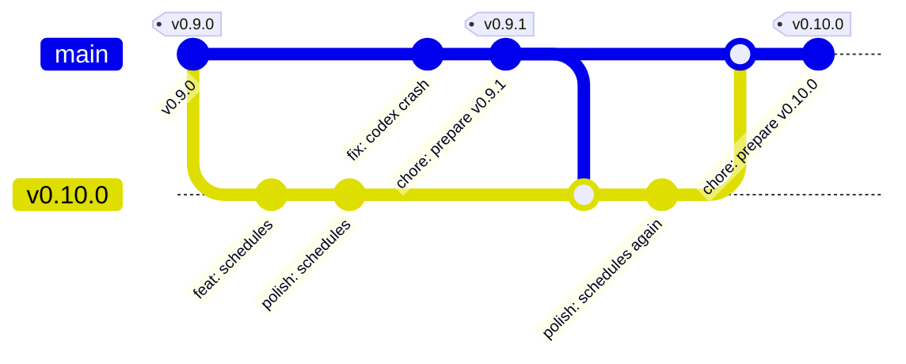

# Contributing to Cadencr

Thanks for your interest in improving Cadencr! This guide covers coding conventions, commit style, and the pull request process.

By participating, you agree to the [Code of Conduct](./.github/CODE_OF_CONDUCT.md). Security issues follow a separate private flow — see [SECURITY.md](./.github/SECURITY.md).

---

## Local Development

Setup (prerequisites, `pnpm setup:dev`, `pnpm doctor`, worktrees) lives in the [README — Run from source](./README.md#run-from-source). Follow that first. The notes below assume your dev environment is running; when it is not, `pnpm doctor` names the problem and its fix.

## Common Commands

```bash
pnpm dev             # run desktop app + backend service (the usual)
pnpm start           # desktop only (skips the service watcher)
pnpm test            # run all tests (vitest + cargo test --workspace + repo scripts)
pnpm run lint        # provider boundaries + oxlint + clippy (all Rust crates)
pnpm run format      # auto-format (oxfmt + rustfmt)
pnpm run format:check
pnpm doctor          # check Node, pnpm, Rust, watcher, .env files, Electron
pnpm setup:dev       # idempotent first-run setup of a main checkout
```

Run only the desktop tests that cover the files you touched (paths relative to
`packages/desktop`):

```bash
pnpm --filter @cadencr/desktop exec vitest related --run src/lib/foo.ts
```

Run a task for a single package:

```bash
pnpm --filter @cadencr/desktop <script>
pnpm --filter @cadencr/service <script>
```

## Rust Build Storage

Cargo targets are intentionally isolated per Git worktree. The main checkout
uses `./target/`; each linked worktree uses its own `<worktree>/target/`.
Repository scripts deliberately do not use `sccache`: it did not produce cache
hits between Cadencr worktrees, while forcing Cargo incremental compilation off
and consuming another large machine-wide cache. The development and test
profiles keep Cargo's own incremental cache instead, which accelerates repeated
builds inside each active worktree.

Do not set `CARGO_TARGET_DIR` to `.shared-cargo-target` or another shared path.
Sharing Cargo targets can mix branch artifacts, create lock contention, and
leave large directories behind after worktrees are removed. The repository's
Cargo wrapper overrides inherited `CARGO_TARGET_DIR` values to enforce the
per-worktree policy.

Use the wrapper for targeted Cargo commands:

```bash
pnpm rust -- test -p cadencr-service shared::migrate
pnpm rust -- check -p opencode-sdk-rs
```

The default development and test profiles omit debug information to keep
every worktree's Cargo target small; incremental state is the bulk of what
remains, and `pnpm rust:clean` / `pnpm rust:prune` below reclaim it. Omitting
debug information does not disable application logs. For a debugger-oriented
test run with line tables, use:

```bash
pnpm rust -- test --profile test-debug -p cadencr-service <test-name>
```

Precompile the Rust targets used by `pnpm dev` without starting the app:

```bash
pnpm dev:precompile
```

For Cadencr-managed worktrees, set the project's worktree setup commands to
`pnpm install && pnpm dev:configure-worktree && pnpm dev:precompile`. The setup
runs in the new worktree, so it gets its own `.env` ports and a warm local
`target/` before the first `pnpm dev`.

Inspect and clean storage with dry-run-first commands:

```bash
pnpm rust:storage                         # targets, dev databases and backups
pnpm rust:clean                           # preview cleaning the current target
pnpm rust:clean -- --release --apply      # remove current release artifacts
pnpm rust:prune                           # preview non-main targets unused for 14 days
pnpm rust:prune -- --older-than 7d --apply
```

`rust:prune` never cleans the main checkout, the current checkout, or symlinked
targets. Deleted artifacts are safe to rebuild, but applying a
cleanup causes the next Rust command in that worktree to perform a cold build.

### Dev databases

Dev databases are usually bigger than the Cargo targets, so worktrees keep
them cheap:

- `pnpm dev:configure-worktree` seeds a worktree's database as a copy-on-write
  clone of the main checkout's (`cp -c` on APFS, reflink elsewhere). The clone
  shares its blocks until either side writes, so a multi-GB database costs
  almost nothing per worktree. Worktrees created before this change hold full
  copies.
- Only when that run clones the database, and the worktree's `CADENCR_DB_PATH`
  points at the clone, does it set `CADENCR_DEV_SKIP_DB_BACKUP=1` in the
  worktree's service `.env`. Debug builds then skip the pre-migration
  `VACUUM INTO` snapshot, which would be a full, unshared copy of data the main
  checkout still holds. Every other database keeps its backups: one the
  worktree already had (it holds the worktree's own data, so rerunning the
  script never replaces it and drops the flag), and a custom `CADENCR_DB_PATH`,
  which may name a shared database. The main checkout and release builds
  always back up before migrating.

`pnpm rust:storage` lists every dev database and the installed app's
`~/.cadencr/database`, and names the backups the service never rotates (legacy
`<version>.<hour>` snapshots without a source identity, hand-made `.bck`
copies). Nothing deletes those automatically: check you no longer need them,
then remove them yourself.

Troubleshoot the effective configuration with:

```bash
echo "${CARGO_TARGET_DIR:-<unset>}"
cargo metadata --no-deps --format-version 1 | jq -r .target_directory
pnpm rust:storage
```

---

## Project Conventions

The full ruleset for code style, file/function size limits, and architectural boundaries lives in [`.claude/rules/`](./.claude/rules/). Claude Code loads those files directly (each rule's `paths:` frontmatter scopes it to the files it applies to); for Codex and OpenCode they are mirrored into the auto-generated `## Rules` section of [`AGENTS.md`](./AGENTS.md) by `pnpm build:agents-md`. Read them before opening a PR.

The three rules contributors hit most often:

- Use **pnpm**, not `npm` or `yarn`.
- When the Rust API surface changes, regenerate the frontend API client with `pnpm --filter @cadencr/desktop run generate:api` and commit `packages/desktop/src/api/generated/index.ts`.
- Keep files under **400 lines** and functions under **100 lines**; extract modules before crossing those limits.

---

## Issue and PR Labels

Maintainers keep labels intentionally simple. Contributors do not need to pick every label themselves, but please choose the most specific issue template and fill out the requested fields so maintainers can label quickly.

| Label               | Meaning                                      |
| ------------------- | -------------------------------------------- |
| `Feature`           | New user-visible capability or improvement   |
| `Fix`               | Bug fix or regression                        |
| `Desktop`           | Electron/React desktop app                   |
| `Backend`           | Rust service or SDK/backend integration work |
| `provider:claude`   | Claude-specific behavior                     |
| `provider:codex`    | Codex-specific behavior                      |
| `provider:opencode` | OpenCode-specific behavior                   |
| `Planned`           | Accepted and expected to be worked on        |
| `Will fix`          | Confirmed fix for a bug/regression           |
| `Not planned`       | Maintainers do not plan to work on this      |
| `Duplicated`        | Duplicate of another issue or PR             |

Provider labels should be used only when the work is truly provider-specific. Generic frontend/backend code should stay provider-neutral.

## Issue Lifecycle

1. Maintainers label the work as `Feature` or `Fix`.
2. Maintainers add `Desktop`, `Backend`, and provider labels when relevant.
3. Accepted work gets `Planned`; confirmed bugs get `Will fix`.
4. Work that will not be pursued gets `Not planned`; duplicates get `Duplicated`.
5. Closing PRs should use GitHub keywords such as `Closes #123` so issues close automatically on merge.

---

## Branching

Cadencr keeps `main` long-lived and creates a version-named integration branch for each
feature release:

| Branch                                | Meaning                                                | What lands here                                                      |
| ------------------------------------- | ------------------------------------------------------ | -------------------------------------------------------------------- |
| **`vX.Y.Z`** (for example, `v0.10.0`) | Temporary integration branch for that release.         | Feature branches, dependency bumps, follow-up polish                 |
| **`main`**                            | Releasable. Every commit is a valid release candidate. | Promotions from a version branch, urgent fixes, release-prep commits |

Release tags (`vX.Y.Z`) are always cut from `main`. Pushing a tag triggers
[`desktop-release.yml`](./.github/workflows/desktop-release.yml), which notarizes the app, publishes the
GitHub release, and updates the Homebrew cask — so a tag reaches users immediately and its version number
is spent for good.

**Why a version branch.** A feature is usually merged before it is polished. When the integration branch
is also the release source, that half-finished feature blocks every unrelated fix from shipping until the
polish is done. Keeping unpolished work on a branch named for its intended release means `main` can be
tagged at any moment, while the branch name makes the target milestone explicit.



### Day-to-day work

1. Find the active version branch for the upcoming feature release — for example, `v0.10.0`.
2. Branch from that version branch, not `main`. Use short-lived branches named with a scope prefix and a
   short slug — for example `feat/desktop-sidebar-redesign`, `fix/session-runtime-status`,
   `chore/bump-electron`.
3. Rebase onto the latest version branch before opening a pull request, and target that branch with the PR.
4. Polish, follow-up fixes, and review feedback for that feature also go to the same version branch.
5. When the feature is genuinely done — tested in the running app, no known rough edges — a maintainer
   promotes the version branch into `main`.

```bash
git switch v0.10.0 && git pull
git switch -c feat/my-thing
# …work, then open a PR against v0.10.0…
```

### Promoting to `main`

Promotion is a maintainer action and always a merge commit, so a release range maps cleanly onto the set
of promotions it contains:

```bash
git switch main && git pull
git merge --no-ff v0.10.0
git push origin main
```

Promote whole, finished work only. If the version branch contains one polished feature and one still in progress,
wait — or land the finished part on `main` directly as its own branch off `main`.

### Urgent fixes while a version branch is mid-polish

This is the case the flow exists for. Branch off `main`, merge back into `main`, release, then **merge
`main` down into the active version branch in the same session**:

```bash
git switch main && git pull
git switch -c fix/urgent-thing
# …fix, test…
git switch main && git merge --no-ff fix/urgent-thing && git push origin main
git switch v0.10.0 && git merge main && git push origin v0.10.0   # never skip this
```

**The one rule that keeps this cheap:** `main` must never stay ahead of the active version branch. Every
commit that lands on `main` — a fix, a release-prep commit, a hotfix tag — gets merged down into that
version branch right away. Skip it once and the next promotion turns into conflict archaeology.

### Releasing

Releases run from `main` via the `release` skill (`.claude/skills/release/SKILL.md`), which writes the
changelog, bumps versions, runs a security review, verifies `origin/main` is green, and tags. For a feature
release:

1. Promote the `vX.Y.Z` branch into `main`.
2. Delete the version branch locally and remotely.
3. Run the release skill from `main` to create the `vX.Y.Z` tag.
4. Create the next version branch from the released `main` when feature development resumes.

The branch and release tag intentionally use the same name, so the branch must be deleted **before**
tagging; otherwise Git commands can become ambiguous between `refs/heads/vX.Y.Z` and
`refs/tags/vX.Y.Z`.

## Commit Convention

Commits follow **[Conventional Commits](https://www.conventionalcommits.org/)**:

```
<type>(<scope>): <short imperative summary>
```

- **Types**: `feat`, `fix`, `refactor`, `chore`, `docs`, `style`, `test`, `perf`, `build`.
- **Scopes** (optional): package or area — `desktop`, `service`, `session`, `providers`, `landing`, `agent`, etc.
- One logical change per commit. Explain **why**, not just **what**, in the body when the diff is non-obvious.
- Husky runs a scoped pre-commit check (see [Pre-commit checks](#pre-commit-checks)). Do not bypass it (`--no-verify`) unless a maintainer asks.

Run `git log --oneline` in this repo for a large set of real examples.

## Pre-commit checks

`.husky/pre-commit` runs `node scripts/pre-commit.mjs`, which reads the staged
file list and runs only the checks those files can affect, streaming their
output and stopping at the first failure with the exact command to rerun:

| Staged files                                                                                                                                                          | Checks                                                                                   |
| --------------------------------------------------------------------------------------------------------------------------------------------------------------------- | ---------------------------------------------------------------------------------------- |
| anything                                                                                                                                                              | `AGENTS.md` is in sync with `.claude/rules/`                                             |
| docs only (`*.md` outside a package's `src/`, `docs/**`)                                                                                                              | nothing else                                                                             |
| any other file                                                                                                                                                        | root script tests (`pnpm run test:scripts`, a few seconds)                               |
| `packages/desktop`, `packages/landing`, `packages/brand`                                                                                                              | that package's `format:check`, `lint`, `ts-check`, `knip` through Turbo, and its tests   |
| desktop sources                                                                                                                                                       | `vitest related --run` on the staged desktop files only                                  |
| desktop `vitest.config.*`, `src/test-setup*`, `src/test/**`, `package.json`                                                                                           | the full desktop suite                                                                   |
| desktop `src/lib/shortcuts/**`, `src/shared/**`                                                                                                                       | landing checks too (it imports the shortcut registry)                                    |
| `packages/brand/src/**`                                                                                                                                               | desktop and landing checks too, tracing desktop tests that import the brand file         |
| `packages/service/src`, `packages/desktop/src`                                                                                                                        | provider-boundary scan                                                                   |
| Rust: `packages/service`, any `packages/*-rs`, `packages/cli-discovery`, `Cargo.toml`/`Cargo.lock`, `rust-toolchain.toml`                                             | `@cadencr/service` `format:check`, `lint` (clippy), `test` for the whole Cargo workspace |
| release scripts, `homebrew/**`, `desktop-release.yml`                                                                                                                 | `pnpm run test:release-scripts`                                                          |
| root tooling: `package.json`, `pnpm-lock.yaml`, `pnpm-workspace.yaml`, `turbo.json`, `.oxlintrc.json`, `.oxfmtrc.json`, `.npmrc`, `.nvmrc`, `.husky/**`, `patches/**` | everything                                                                               |

Preview the plan without running it, or force the full workspace check (also
what CI runs):

```bash
node scripts/pre-commit.mjs --dry-run
CADENCR_PRECOMMIT_FULL=1 git commit
```

Checks run against your working tree, so unstaged edits in the same files are
checked too. CI always runs everything, so a scoped pass locally is not a
guarantee.

## Pull Request Process

1. **Target the active version branch.** Contributor PRs are opened against the upcoming release branch
   (for example, `v0.10.0`), never against `main` — see [Branching](#branching). Only maintainers push to
   `main`, for promotions, urgent fixes, and release prep.
2. **Open early.** Draft PRs are welcome for feedback before the work is final.
3. **Use the PR template.** It prompts for summary, motivation, and a test plan.
4. **Keep PRs focused.** A PR should be reviewable in one sitting. Split large changes.
5. **CI must be green** — lint, typecheck, tests, knip, and format checks all pass. `ci.yml` runs them as
   parallel `rust`, `web`, `vitest` (sharded) and `scripts` jobs; the required `Pre-commit checks` status
   passes only when all of them do.
6. **Link the issue.** Use `Closes #123`, `Fixes #123`, or explain why there is no issue.
7. **Show visible changes.** Include screenshots or recordings for UI changes.
8. **Merge with `--no-ff`.** Branches land as a merge commit (`git merge --no-ff`), never squashed or
   fast-forwarded, so the history keeps each reviewed commit and the merge commit groups them. Every
   commit on the branch must therefore follow Conventional Commits on its own. Rebase onto the target
   branch first (step 3 of [Day-to-day work](#day-to-day-work)) so the merge carries no conflict
   resolution. Promotions from a version branch to `main` work the same way.

For a bugfix, include a test that fails without the fix. For a feature, include a test that exercises the new behavior end-to-end when practical.

---

## Notes

- `.env` files under `packages/*/` are local-only and must never be committed. They are covered by `.gitignore`.
- Questions? Open a [discussion](https://github.com/merkr-software/cadencr/discussions) or a draft issue.
