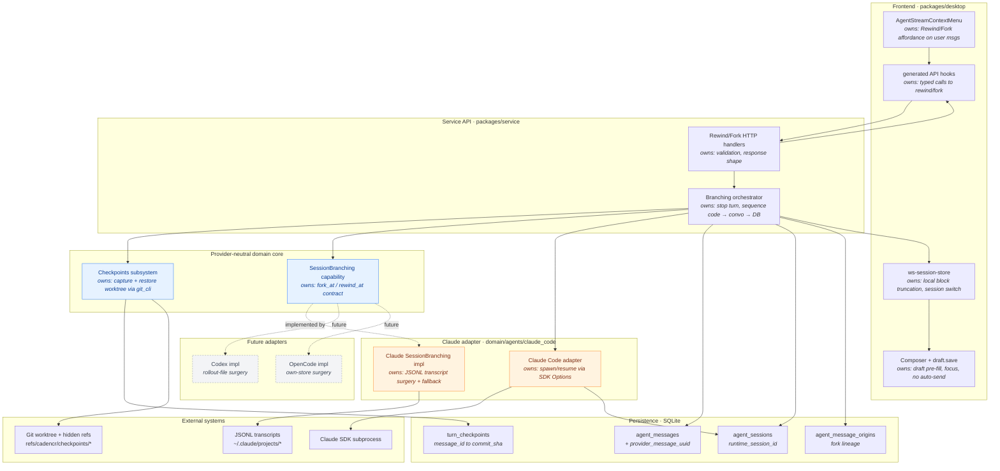
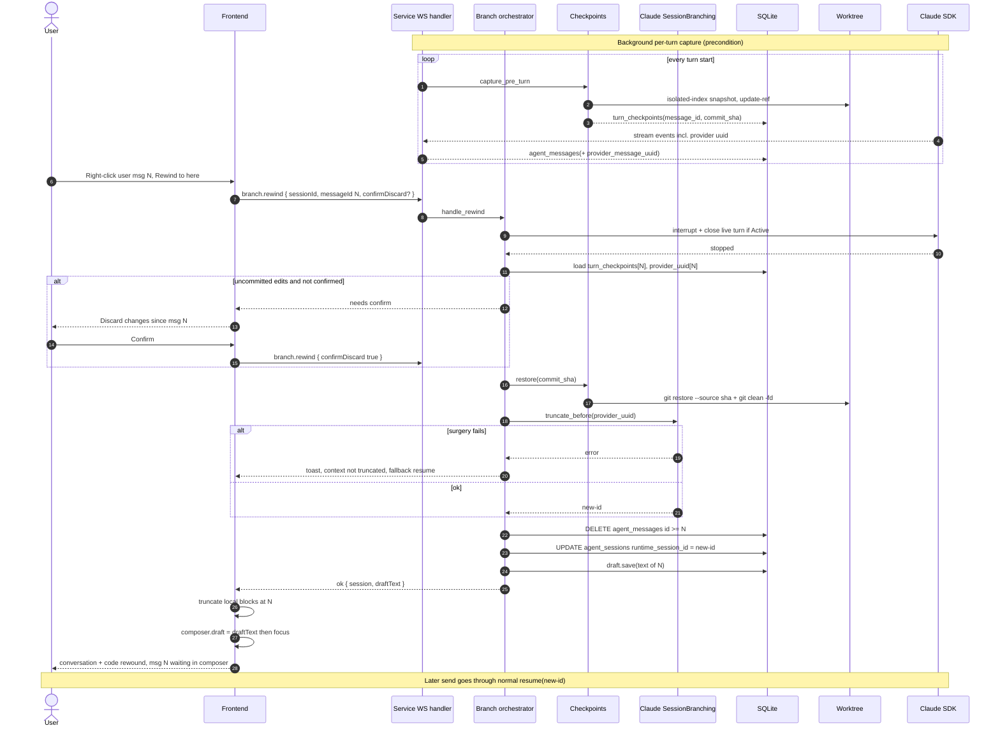
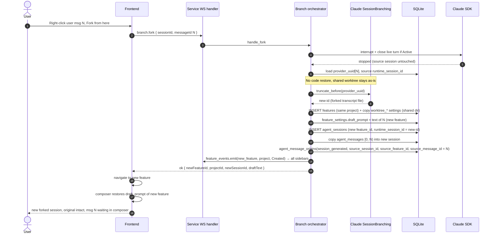

# Rewind & Fork — Implementation Plan

> Status: **Implemented for Claude Code** (Phases 1–6). Codex/OpenCode pending
> (the seam is ready — see §12).
> Audience: an engineer/agent implementing the feature end-to-end.
> Scope of this document: **Claude Code provider first**, but every abstraction is
> designed so Codex and OpenCode can implement the same feature later without
> touching provider-neutral code.

## Implementation notes (what shipped vs. the plan)

- **Context cut = ordinal, not uuid, for Claude.** Claude assigns a JSONL `uuid`
  to a user prompt only when it writes the transcript line; the headless stream
  does not reliably echo the prompt back, and resume-replays would mis-stamp. So
  the `provider_message_uuid` column ships (nullable, future-proof) but the
  Claude cut is resolved by **ordinal** — the Nth real user-prompt line (tool
  results / meta / compact-summary lines excluded). The `SessionBranching`
  contract still *prefers* `cut_provider_uuid` when a provider populates it, so
  uuid-match is live for future adapters. Matches §10's documented fallback,
  here promoted to the Claude primary.
- **Per-turn checkpoint capture** is wired into BOTH the pending (first prompt)
  and followup (steering / subsequent turns) paths, because Claude keeps the CLI
  alive between turns and most prompts after the first take the followup path.
  Capture runs synchronously before the prompt reaches the agent (so the snapshot
  is genuinely pre-edit) but holds no session lock.
- **Fork creates a new *feature* that shares the source worktree** (open question
  #1 resolved this way instead of deferring). The feature view binds exactly one
  session and there is no multi-session switcher, so rather than spawn a second
  session inside the source feature, fork mints a **new feature** (first-class
  sidebar entry + view) under the same project. It copies the source feature's
  `worktree_*` settings verbatim, so the new feature resolves to the **identical
  worktree directory** with **zero git ops** — the provisioning replay
  short-circuits on the already-present path (a `git worktree add` on the
  already-checked-out branch would otherwise fail). The chosen message's text is
  written to the new feature's `feature_settings.draft_prompt` (the source the
  composer actually restores from — the session-scoped `agent_sessions.draft_prompt`
  is **not** what the composer reads). The backend emits `FeatureEventAction::Created`
  so the fork appears in every client's sidebar, and the originating client
  **auto-navigates** to it (a session-scoped `forkNavigation` store signal consumed
  by the source `AgentSession`). Both features then edit the same files — the
  accepted trade-off of sharing one worktree. Rewind (in place) is fully wired too.
- **Checkpoint GC** (open question #3) is not implemented in v1 — `refs/cadencr/
  checkpoints/*` and `turn_checkpoints` rows accumulate until the feature is
  deleted (CASCADE clears the rows). Pick a retention policy in a follow-up.

---

## 1. What we are building

Two per-user-message actions, surfaced from the agent stream:

- **Rewind to here** — roll the conversation **and** the code back to the state
  *before* a chosen user message, **in place** (same session). The chosen
  message's text is restored into the composer as a **draft and is NOT sent** —
  the user can edit and re-send.
- **Fork from here** — create a **new feature** (with its own session) that keeps
  only the context *before* the chosen user message, **sharing the source
  feature's worktree** (no new worktree, no code rollback). The originating client
  navigates to the new feature; the chosen message's text is restored into its
  composer as a **draft and is NOT sent**.

Both actions require **point-in-time truncation of the model's real context**
(not just our UI). See §3 for why and how.

### Non-goals (v1)

- Forking into a separate *worktree* (the fork is a new feature but **shares**
  the source worktree on purpose — see §3). A future "fork into an isolated
  worktree" mode is possible (branch from the fork-point checkpoint) but out of
  v1 scope.
- Rolling back files changed by bash commands or files outside the worktree
  (same limitation as Claude's native `/rewind`).
- Codex / OpenCode implementations (architecture is ready for them — see §12).

---

## 2. Why we can't use Claude's native `/rewind` or `/fork`

Researched against Claude Code 2.1.x docs:

- **`/rewind`** is an **interactive TUI menu** (open with `/rewind` or double
  `Esc`). There is **no headless flag, no `stream-json` command, and no Agent
  SDK method** to trigger a point-in-time restore. Cadencr drives Claude with
  `--print --output-format stream-json --input-format stream-json`, which has no
  terminal UI for that menu to render into. Native checkpoints are Claude's
  internal snapshot store tied to a live interactive process — our subprocess
  can neither trigger nor query them.
- **`/fork`** (alias of `/branch`) has a headless equivalent — the
  **`--fork-session`** flag — but it (a) copies the **entire** transcript (no
  point-in-time cut), and (b) only takes effect on a **live run that sends a
  prompt**, whereas our fork must branch **without sending**. Considered and
  rejected as the primary mechanism for those two reasons.

**Conclusion:** we re-implement the behavior over the headless transport with
**(a) our own git checkpoints for code** and **(b) Claude transcript surgery for
conversation context**.

References: `code.claude.com/docs/en/checkpointing`, `/en/sessions`,
`/en/headless`.

---

## 3. Locked decisions

| Decision | Choice | Rationale |
|---|---|---|
| Context-truncation fidelity | **Faithful transcript surgery** | The model must genuinely forget everything after the cut; matches native `/rewind` and the "keep context before N" spec. Non-truncating resume (t3code-style) and DB-replay were rejected as not meeting the spec. |
| Fork target | **New feature, sharing the source worktree, new Claude session id** | A new feature is a first-class view + sidebar entry, so the fork has somewhere to render and the client can navigate to it (no multi-session switcher needed). It copies the source's `worktree_*` settings, resolving to the *same* directory with no git ops. |
| Fork + code | **Fork does NOT roll back code** | The forked feature shares the source worktree; restoring code under it would clobber the originating feature. Fork branches **conversation only**; code stays at the worktree's current state. Coherent code+conversation rollback is the **rewind** flow's job. |
| Provider isolation | **Adapter/capability trait** | Claude-specific surgery lives behind a trait; generic code never branches on provider identity (project rule). |
| Surgery failure | **Auto-fallback to non-truncating resume + user-visible warning** | Never hard-fail the user action if the internal JSONL format drifts. |

---

## 4. Current architecture (verified anchors)

Real files this plan builds on:

- **Adapter capability trait:** `AgentRuntimeAdapter`
  (`packages/service/src/domain/agents/adapter/adapter_trait.rs:13`) — default-
  method trait, the seam for a new branching capability.
- **Live session trait:** `AgentRuntimeSession`
  (`packages/service/src/domain/agents/adapter/session.rs:27`) — exposes
  `interrupt()` (`:51`), `stream_input()` (steering, `:42`), `session_id()`
  (`:35`), `close()` (`:57`).
- **Turn lifecycle state:** `QueryState { Active { query, .. }, Pending(config) }`
  (`packages/service/src/domain/ws_session/handler/types.rs:20`), held per
  connection in `SdkSessions` keyed by db session id.
- **Send / steering entry:** `handle_prompt_send`
  (`.../session_prompt/prompt_send.rs:21`) — three paths: **followup** (we own
  the live turn → `stream_input`), **owner steering**, **pending spawn**.
- **Cancel entry:** dispatch `"interrupt"`
  (`.../handler/dispatch.rs:95`) → `handle_interrupt`
  (`.../handler/session_control/lifecycle.rs:14`) → `q.interrupt()`.
- **Claude spawn/resume:** `claude_code/adapter_impl.rs:250` builds
  `Options { resume: config.resume_session_id, .. }`; resume id validated as
  UUID (`adapter_impl.rs:23`).
- **Claude session id capture:** from `system/init`
  (`claude-agent-sdk-rs/src/messages/events.rs:79`), persisted via
  `persist_runtime_session_id_*`
  (`.../persistence/session_archiving.rs:54`).
- **JSONL transcript path helpers:** `encode_project_path`,
  `claude_projects_dir_for`, `parse_session_file`
  (`domain/imports/claude_code_jsonl.rs`). **Reuse these — do not reinvent.**
- **Message store:** `agent_messages` (`migrations/0001_baseline.sql:120`),
  ordered by autoincrement `id`; user msg = `role='user' AND
  message_type='user_message'`. Model `AgentMessageRow`
  (`domain/sessions/models.rs:30`).
- **Lineage table (reuse for fork):** `agent_message_origins`
  (`migrations/20260618120000_mcp_orchestration_schema.sql`), `origin_kind IN
  ('human','session_generated','system_generated','imported')`.
- **Worktree:** per-feature at `~/.cadencr/worktrees/{project}/{branch}`;
  path/branch in `feature_settings`; git plumbing in `shared/git_cli.rs`
  (`run_git`, `run_git_safe`, `run_git_capture`) and
  `domain/git/commands/worktree_ops.rs`. **No per-turn checkpoint exists today —
  this is the main net-new substrate.**
- **Composer draft persistence already exists:** WS routes `"draft.save"` /
  `"draft.get"` (`dispatch.rs:112-113`,
  `handler/session_data.rs`). **Reuse this to pre-fill the draft** instead of
  inventing a new channel.
- **Frontend per-message menu:** `AgentStreamContextMenu`
  (`packages/desktop/src/components/agent-session/AgentStreamContextMenu.tsx`)
  already wraps every block — natural home for the affordance.
- **User bubble + provenance badge:** `UserMessageBlock.tsx` already renders an
  origin badge from `agent_message_origins`.
- **Session store:** `ws-session-store.ts` (blocks, `sendPrompt`, `sendRaw`),
  envelopes in `lib/ws-envelope.ts` (`createPromptSend`, `createInterrupt`).

---

## 5. Architecture of responsibilities



**Invariant:** the only provider-aware nodes are inside the orange `CLAUDE` box,
reached exclusively through the `SessionBranching` capability. The orchestrator,
checkpoints subsystem, HTTP layer, DB, and frontend are all provider-neutral.

---

## 6. Data model

New migration (follow `.claude/rules/migration-safety` — additive, no destructive
rebuilds):

```sql
-- turn_checkpoints: links a user message to the worktree snapshot taken
-- immediately BEFORE that turn ran (i.e. the "before message N" code state).
CREATE TABLE turn_checkpoints (
    message_id  INTEGER PRIMARY KEY REFERENCES agent_messages(id) ON DELETE CASCADE,
    commit_sha  TEXT NOT NULL,        -- orphan commit under refs/cadencr/checkpoints/*
    kind        TEXT NOT NULL DEFAULT 'pre_turn',  -- pre_turn | post_turn (future)
    created_at  TEXT NOT NULL DEFAULT (datetime('now'))
);

-- map a Cadencr message row to the provider's own message id, so transcript
-- surgery can find the exact cut line. Provider-neutral column name.
ALTER TABLE agent_messages ADD COLUMN provider_message_uuid TEXT;
CREATE INDEX idx_agent_messages_provider_uuid
    ON agent_messages(session_id, provider_message_uuid);
```

Notes:

- `turn_checkpoints` is a **side table** so the hot `agent_messages` path is
  untouched.
- `provider_message_uuid` is **provider-neutral by name** (Claude stores its
  per-message `uuid`; Codex/OpenCode store their own id).
- Fork lineage reuses **`agent_message_origins`** — no new table.

---

## 7. Backend design

### 7.1 Capability seam (adapter pattern, future-proof)

Add an **optional capability** to `AgentRuntimeAdapter` — default `None`, so
providers that don't support branching are simply inert (no provider branching
in generic code):

```rust
// adapter/branching.rs  (new)
#[async_trait]
pub trait SessionBranching: Send + Sync {
    /// Produce a NEW provider session id whose context ends immediately before
    /// `cut_provider_uuid`. Used by both rewind (in place) and fork (new session).
    /// `source_runtime_session_id` is the provider session being branched from.
    async fn truncate_before(
        &self,
        ctx: &BranchContext,            // cwd, source_runtime_session_id, cut_provider_uuid
    ) -> Result<BranchResult, BranchError>;  // { new_runtime_session_id }
}

// adapter_trait.rs — new default method on AgentRuntimeAdapter
fn session_branching(&self) -> Option<&dyn SessionBranching> { None }
```

The orchestrator calls `adapter.session_branching()`; if `None`, the action is
reported unsupported for that provider (graceful, surfaced to UI). Rewind vs fork
is an **orchestration concern**, not a provider concern — both use the same
`truncate_before`. This keeps the provider surface minimal and identical across
Claude/Codex/OpenCode.

### 7.2 Claude `SessionBranching` impl — transcript surgery

Location: `domain/agents/claude_code/branching.rs`.

Algorithm for `truncate_before`:

1. Resolve transcript path with the existing import helpers:
   `claude_projects_dir_for(cwd).join(format!("{source_id}.jsonl"))`.
2. Read the JSONL **leniently** — parse each line as `serde_json::Value`; only
   read the fields we need (`uuid`, `sessionId`). Never deserialize into a strict
   struct (format is version-unstable per Anthropic docs).
3. Find the cut index = first line whose `uuid == cut_provider_uuid`. Keep lines
   `[0, cut)`. (Fallback if uuid missing: ordinal match on the Nth
   `type == "user"` line — see §10.)
4. Generate `new_id = uuid v4`. Rewrite the `sessionId` field on every kept line
   to `new_id` (keeps the resume chain self-consistent). Leave `uuid` /
   `parentUuid` chains intact — a truncated prefix is a valid leaf.
5. Write `claude_projects_dir_for(cwd).join(format!("{new_id}.jsonl"))`
   atomically (temp file + rename).
6. Return `BranchResult { new_runtime_session_id: new_id }`.

Later resume uses the **existing** `Options { resume: Some(new_id) }` path — no
new spawn code.

On any failure (parse error, missing file, uuid not found and ordinal fallback
also fails): return `BranchError::Unsupported`/`::Surgery` so the orchestrator
falls back to **non-truncating resume of the source session** and emits a
user-visible warning toast (`.claude/rules/error-handling`: never swallow).

Keep this file < 400 lines (`.claude/rules/file-size`); split a
`jsonl_surgery.rs` helper if needed.

### 7.3 Checkpoints subsystem (provider-neutral)

Location: `domain/checkpoints/` (new module). Pure git, no provider knowledge.

**Capture** (`capture_pre_turn`): on each turn start, before the agent edits,
snapshot the worktree using an **isolated index** so the user's real index is
never touched:

```
GIT_INDEX_FILE=<tmp> git -C <worktree> read-tree HEAD
GIT_INDEX_FILE=<tmp> git -C <worktree> add -A -- .
tree=$(GIT_INDEX_FILE=<tmp> git -C <worktree> write-tree)
commit=$(git -C <worktree> commit-tree $tree -m "cadencr checkpoint <feature>/<seq>")
git -C <worktree> update-ref refs/cadencr/checkpoints/<feature>/<seq> $commit
```

Persist `turn_checkpoints(message_id = <the user message that starts this turn>,
commit_sha = $commit, kind='pre_turn')`. Implement via `shared/git_cli.rs`
runners (add an env-injecting variant if one doesn't exist). `git add -A`
respects `.gitignore`, so build artifacts/secrets are not snapshotted.

**Restore** (`restore`): used by rewind only.

```
git -C <worktree> restore --source <sha> --worktree --staged -- .
git -C <worktree> clean -fd -- .      # NOT -x: preserve ignored files
```

**Hook point:** turn start is observed where the spawn/first stream event is
handled — wire capture in the stream/persistence path
(`domain/ws_session/persistence/session_events.rs` or the stream reader). Capture
must be **best-effort and non-blocking to the turn**: if git capture fails, log +
toast but let the turn proceed (a missing checkpoint disables *code* rewind for
that message, not the conversation rewind).

### 7.4 Orchestrator — flows

Location: `domain/ws_session/handler/session_branch/` (new), provider-neutral.

Shared preamble for **both** flows:

1. Resolve db session, target `message_id`, and verify `role='user' AND
   message_type='user_message'`.
2. **Stop the live turn if any** (see §8). For rewind we *must* interrupt+close
   the current Active query before mutating; for fork we must at least read a
   consistent `runtime_session_id`.
3. Load `turn_checkpoints[message_id]` (may be absent → code rewind unavailable)
   and `agent_messages[message_id].provider_message_uuid`.

**Rewind (in place):**

1. (code) If a checkpoint exists: `checkpoints::restore(commit_sha)`. If the
   worktree has uncommitted user edits, require a confirm flag in the request
   (UI shows a dialog first) — refuse without it.
2. (context) `branching.truncate_before(...)` → `new_id` (or fallback).
3. (db) `DELETE FROM agent_messages WHERE session_id=? AND id >= message_id`
   (CASCADE removes their `turn_checkpoints`). `UPDATE agent_sessions SET
   runtime_session_id = new_id`.
4. (draft) Persist the removed message's text as the session draft (reuse the
   `draft.save` mechanism).
5. Respond `{ session, draft_text }`. Streaming resumes through the normal send
   path when the user re-sends.

**Fork (new feature, shared worktree, new session):**

1. **No code restore** (decision §3).
2. (context) `branching.truncate_before(...)` → `new_id`.
3. (db, one tx) Create a **new feature** under the source's `project_id`; copy the
   source feature's `worktree_*`/`skip_worktree` settings so it resolves to the
   same directory; write the chosen message's text to the new feature's
   `feature_settings.draft_prompt`; create an `agent_sessions` row under the **new**
   feature, copy `agent_messages[0, message_id)` into it, set `runtime_session_id =
   new_id`. Record lineage: `agent_message_origins(origin_kind='session_generated',
   source_session_id, source_feature_id, source_message_id=message_id)`.
4. (broadcast) `feature_events.emit(new_feature_id, Some(project_id), Created)` so
   every client's sidebar shows the fork.
5. Respond `{ newFeatureId, projectId, newSessionId, draftText }`. The originating
   client navigates to the new feature; its composer restores the draft.

### 7.5 Transport — routes

These are stateful session operations that interact with live `SdkSessions`, so
follow the existing **WS dispatch** pattern rather than bare HTTP (mirrors
`interrupt`, `compact`, `clear`). Add to `dispatch.rs`:

```
"branch.rewind" => session_branch::handle_rewind(...)
"branch.fork"   => session_branch::handle_fork(...)
```

Frontend envelopes in `lib/ws-envelope.ts`: `createRewind(sessionId, messageId,
{ confirmDiscard })`, `createFork(sessionId, messageId)`. (If a typed HTTP
response is preferred for the new-session payload on fork, expose a thin
`POST .../fork` and regenerate the API client per the repo workflow — but the WS
route is the lower-friction default.)

---

## 8. Turn steering & cancelling (must-handle interplay)

The feature must compose correctly with the existing live-turn machinery.

- **Steering (message added during a turn)** — `handle_prompt_send`'s followup
  path streams into the live `Active` query (`stream_input`). **Rule:** rewind /
  fork **target a persisted user message**, which means the turn that produced
  the messages after it has already completed for those rows. If a turn is
  *currently live* when the user triggers rewind/fork, the orchestrator first
  **interrupts and closes** that live turn (reuse `q.interrupt()` then drop the
  `Active` state to `Pending`), exactly as `handle_interrupt` does
  (`session_control/lifecycle.rs:14`, `session_gate.rs:171`). Steering deltas
  that arrived but were not yet persisted are discarded by the truncation +
  `runtime_session_id` swap.
- **Cancelling (stop during a turn)** — reuse the existing interrupt path; do not
  invent a second cancel. The orchestrator's "stop live turn" preamble calls the
  same `interrupt()` the Stop button uses. After interrupt, the partial assistant
  output already persisted up to `message_id` is preserved; everything `>=
  message_id` is deleted by rewind (or simply not copied by fork).
- **Receipts / pending-spawn** — if the session is in `Pending` (no live turn),
  skip the interrupt step. If a prompt receipt is in flight (optimistic user
  block not yet acknowledged), the orchestrator must operate on **persisted**
  rows only and let the frontend reconcile its optimistic block on the response.

**Ordering guarantee:** stop-turn → (rewind: restore code) → truncate context →
mutate db → save draft → respond. The live `SdkSessions` lock is held only for
the stop-turn transition, not for the git/file work (avoid blocking other
sessions — `.claude/rules/frontend-performance` spirit applies to the backend
event loop too).

---

## 9. Sequence diagrams

### 9.1 Rewind



### 9.2 Fork



---

## 10. Edge cases & failure handling

- **Missing `provider_message_uuid`** (older messages predating the column):
  fall back to **ordinal matching** — cut before the Nth `type=="user"` line in
  the JSONL, where N is computed from `agent_messages` ordering. If even that is
  ambiguous, fall back to non-truncating resume + warn.
- **Missing checkpoint** (capture failed or message predates the feature): code
  rewind is unavailable for that message. Still allow **conversation** rewind;
  disable the "restore code" affordance and tell the user.
- **Uncommitted user edits at rewind:** require explicit confirm (request flag);
  the UI shows a dialog. Mirrors native `/rewind` warning. Never discard silently.
- **Surgery / JSONL format drift:** never hard-fail — fallback resume + toast.
  Add a lightweight format sanity check (expected top-level keys) and log the CLI
  version for triage.
- **`git clean -fd`** must **not** use `-x` (would nuke ignored files like
  `.env`, `node_modules`). Restrict to the worktree path.
- **Files outside the worktree / bash `rm`/`mv`:** not covered (documented
  limitation, same as native).
- **No multi-session switcher needed (fork):** rather than display two sessions in
  one feature, fork mints a **new feature** — a first-class view the client
  navigates to. This sidesteps the "can the feature UI show >1 session?" question
  entirely.
- **Resume scoping:** `claude --resume <id>` is scoped to the cwd it was created
  in; the forked `.jsonl` must live in the **same** `~/.claude/projects/<encoded
  cwd>/` dir as the source (it does, because the forked feature shares the source
  worktree, so the cwd is identical).
- **Error surfacing:** every failure path returns a typed error and a toast (no
  silent catches) per `.claude/rules/error-handling`.

---

## 11. Phased delivery (each phase independently shippable)

- [x] **Phase 1 — Checkpoints subsystem (provider-neutral).** `domain/checkpoints/`
      (`git_ops` + `repo` + `mod`), `turn_checkpoints` migration, capture hook on
      turn start (pending + followup), restore fn, `run_git_with_env` for the
      isolated-index snapshot. Tests: §13 git round-trip + migration cascade.
- [x] **Phase 2 — Capability seam + Claude surgery.** `SessionBranching` trait +
      `session_branching()` default, Claude `branching.rs` + `jsonl_surgery.rs`,
      `provider_message_uuid` column (ordinal cut is the Claude primary — see
      Implementation notes). Unit-tested against fixture JSONL.
- [x] **Phase 3 — Rewind orchestrator + WS route + stop-turn interplay.**
      `branch.rewind`, interrupt/close live turn, restore + truncate + db +
      draft, dirty-worktree confirm gate. DB-level tests for the delete path.
- [x] **Phase 4 — Fork orchestrator + lineage + WS route.** `branch.fork` creates
      a **new feature** sharing the source worktree (copied `worktree_*` settings),
      a session under it, message copy `[0,N)`, `feature_settings.draft_prompt`,
      `agent_message_origins` badge, and a `Created` feature event. One transaction.
      DB-level tests for the feature/worktree/copy + lineage.
- [x] **Phase 5 — Frontend.** `AgentStreamContextMenu` items gated on
      `user_message`, confirm dialog, local block truncation, draft pre-fill +
      focus, provenance badge. Fork **auto-navigates** to the new feature
      (session-scoped `forkNavigation` signal → `AgentSession` effect).
- [x] **Phase 5.1 — Live-message branchability.** Rewind/Fork target a persisted
      message id. A message sent in the *current* session is a local `ws-user-*`
      block with no DB id, so the menu items were hidden on it until reload (only
      blocks re-seeded from the DB as `msg-<id>` were branchable). Fix: every
      `prompt.send` now carries a **`user_message_ref`** — a client-generated id
      stored on the local block as `clientMessageId`, generated for *every* send
      (first/queued, idle follow-up, and steering) and threaded through the queue
      for the first message. The backend echoes it in a `session/prompt_persisted`
      ack to the sender right after persisting the user message (both the initial
      and follow-up persist sites). The frontend stamps `messageDbId` on the
      matching live block (id/key left untouched → no Virtuoso remount) and the
      gate reads `block.messageDbId ?? messageIdFromBlockId(block.id)`. The ack is
      emitted at persist time (before the agent acks), so it precedes any
      `prompt_received`. Note `user_message_ref` is deliberately distinct from
      `client_message_id` (receipt/steering-only) so idle/first sends don't engage
      the receipt machinery. **Known gap:** plan approve/reject synthetic messages
      (`ws-session-actions.ts`) bypass `sendPrompt` and remain reload-only.
- [x] **Phase 6.1 — Transcript-path encoding fix.** `encode_project_path`
      (`imports/claude_code_jsonl.rs`) replaced only `/` with `-`, but Claude
      Code replaces *every* non-alphanumeric char (so `/.cadencr` → `--cadencr`,
      not `-.cadencr`). Since all Cadencr worktrees live under `~/.cadencr/`, the
      derived `~/.claude/projects/<dir>` was wrong for every session: the
      transcript was never found, `truncate_before` returned
      `BranchError::Unsupported("transcript not readable …")`, and rewind/fork
      fell back to resuming the **full, un-trimmed** history while showing a
      "Context could not be trimmed" warning. The DB/code rewind still worked, so
      it *looked* fine, but the agent kept its full memory. Fix: replace all
      non-alphanumeric chars with `-`. Also repairs Claude **import** for any
      dotted project path. Regression-tested (`encode_project_path_collapses_dot_dirs`).
- [x] **Phase 6 — Hardening.** Surgery fallback path, JSONL format guard,
      ordinal-match fallback, telemetry (tracing), docs. `pnpm test` / `lint` /
      `ts-check` / `knip` green.

---

## 12. Future providers (Codex, OpenCode)

The seam is already provider-neutral. To add a provider later:

- Implement `SessionBranching::truncate_before` for it and return it from that
  adapter's `session_branching()`:
  - **Codex** — operates on its rollout/session files (its own transcript store);
    same "copy + truncate + new id" shape, different file format. Note Codex
    already has `interrupt`/`steer` (`codex/session.rs:221`, `:325`) the
    orchestrator's stop-turn step reuses.
  - **OpenCode** — operates on its own session storage; same shape.
- **Nothing else changes.** The checkpoints subsystem, orchestrator, DB schema,
  WS routes, and the entire frontend are reused as-is. `provider_message_uuid`
  and `turn_checkpoints` are already provider-neutral. Generic code must continue
  to never branch on provider identity (project rule); all per-provider logic
  stays inside that provider's `branching.rs`.

---

## 13. Testing

- **Checkpoints (Phase 1):** Rust tests in a temp git repo — capture creates a
  ref + row; restore returns the tree to the snapshot incl. added/deleted files;
  `clean -fd` removes new untracked files but preserves `.gitignore`d ones; the
  user's real index is untouched (isolated `GIT_INDEX_FILE`).
- **Surgery (Phase 2):** fixture `.jsonl` → assert cut index, `sessionId`
  rewrite, atomic write, and that a malformed line triggers the fallback error
  rather than a panic.
- **Orchestrator (Phase 3/4):** with a fake `AgentRuntimeSession`
  (`session.rs` already has test fakes) assert: live turn is interrupted before
  mutation; rows `>= N` deleted (rewind) / `[0,N)` copied (fork);
  `runtime_session_id` swapped/created; draft saved; lineage row written.
- **Steering/cancel interplay:** test that triggering rewind during an `Active`
  turn interrupts it first, and during `Pending` skips interrupt.
- **Frontend:** vitest for store truncation + draft pre-fill; the `qa` skill for
  an end-to-end smoke test (rewind a real Claude session, confirm context and
  code both rolled back and the draft is pre-filled but unsent).
- Run `pnpm test`, `pnpm lint`, `pnpm --filter @cadencr/desktop ts-check`, and
  (after any Rust API surface change) `pnpm --filter @cadencr/desktop run
  generate:api`.

---

## 14. Open questions to confirm before/during build

1. **Multiple sessions per feature in the UI** — RESOLVED by not needing it: fork
   creates a **new feature** (its own view), so the feature view never has to host
   >1 session. The client auto-navigates to the new feature after fork.
2. **Fork code semantics** — confirmed v1 = no code rollback (conversation-only),
   and the forked feature **shares** the source worktree. Revisit only if product
   wants an "isolated fork" mode (own worktree branched from the fork-point
   checkpoint), which reverses the shared-worktree decision.
3. **Checkpoint retention** — when to GC `refs/cadencr/checkpoints/*` and
   `turn_checkpoints` rows (e.g. on feature delete, or a depth cap). Native
   Claude GCs at 30 days; pick a policy in Phase 1.
